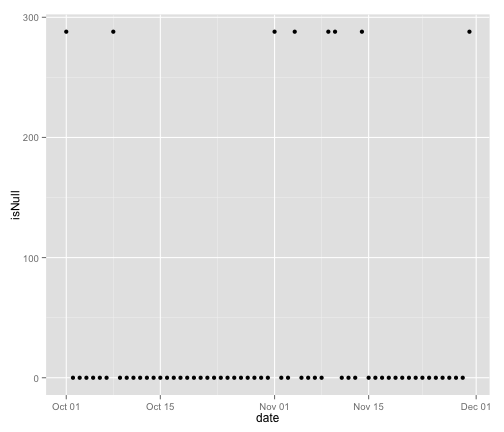
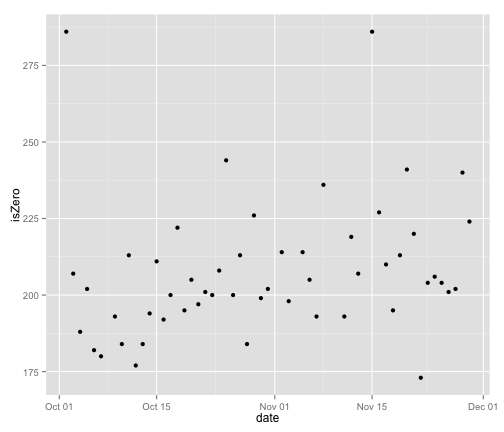
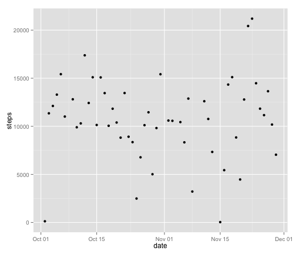
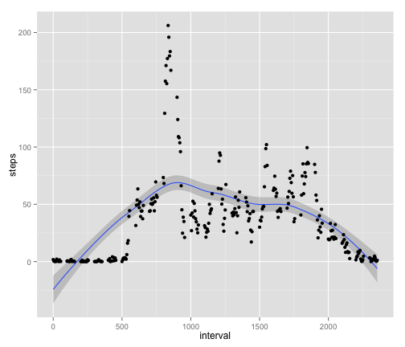

Reproducible Research Assignment 1
========================================================

## Loading and preprocessing the data
Data is loaded into R and date field is recast from factor to date.  

```r
## Data loaded into R
data <- read.csv("activity.csv",header=TRUE)

## Date Recast to date format using lubridate package
library(lubridate)
data$date <- ymd(data$date)
```

Initial exploration identifies several days with all NA values.  It is assumed the measuring device was not worn on these days.  These will be dealt with later in the analysis.

```r
## explore null values by day
data$isNull <- is.na(data$steps)
library(ggplot2)
qplot(date,isNull,data=aggregate(isNull ~ date, data=data,sum))
```

 

Initial analysis also identifies several days where nearly all values are 0.  It is assumed the measuring device was not worn on these days either, but these will be left in the data set.


```r
## explore zero values by day
data$isZero <- data$steps==0
library(ggplot2)
qplot(date,isZero,data=aggregate(isZero ~ date, data=data,sum))
```

 

The data now appears ready for analysis.

```r
## Pull initial stats
str(data)
```

```
## 'data.frame':	17568 obs. of  5 variables:
##  $ steps   : int  NA NA NA NA NA NA NA NA NA NA ...
##  $ date    : POSIXct, format: "2012-10-01" "2012-10-01" ...
##  $ interval: int  0 5 10 15 20 25 30 35 40 45 ...
##  $ isNull  : logi  TRUE TRUE TRUE TRUE TRUE TRUE ...
##  $ isZero  : logi  NA NA NA NA NA NA ...
```

```r
head(data)
```

```
##   steps       date interval isNull isZero
## 1    NA 2012-10-01        0   TRUE     NA
## 2    NA 2012-10-01        5   TRUE     NA
## 3    NA 2012-10-01       10   TRUE     NA
## 4    NA 2012-10-01       15   TRUE     NA
## 5    NA 2012-10-01       20   TRUE     NA
## 6    NA 2012-10-01       25   TRUE     NA
```

## What is mean total number of steps taken per day?
Steps are aggregated by day into a new data frame.  A plot of steps per day is generated, and the mean and median of steps per day is calculated.

```r
stepsPerDay <- aggregate(steps ~ date,data=data,sum)
head(stepsPerDay)
```

```
##         date steps
## 1 2012-10-02   126
## 2 2012-10-03 11352
## 3 2012-10-04 12116
## 4 2012-10-05 13294
## 5 2012-10-06 15420
## 6 2012-10-07 11015
```

```r
str(stepsPerDay)
```

```
## 'data.frame':	53 obs. of  2 variables:
##  $ date : POSIXct, format: "2012-10-02" "2012-10-03" ...
##  $ steps: int  126 11352 12116 13294 15420 11015 12811 9900 10304 17382 ...
```

```r
qplot(date,steps,data=stepsPerDay,sum)
```

 

```r
mean(stepsPerDay$steps)
```

```
## [1] 10766
```

```r
median(stepsPerDay$steps)
```

```
## [1] 10765
```

## What is the average daily activity pattern?


## Imputing missing values


## Are there differences in activity patterns between weekdays and weekends?

You can also embed plots, for example:


```r
plot(cars)
```

 
