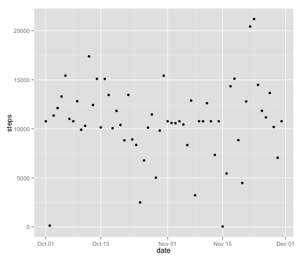
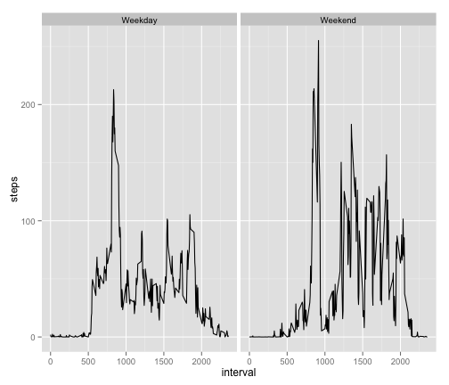

Reproducible Research Assignment 1
========================================================

## Loading and preprocessing the data
Data is loaded into R and date field is recast from factor to date.  

```r
## Data loaded into R
data <- read.csv("activity.csv",header=TRUE)

## Date Recast to date format using lubridate package
library(lubridate)
data$date <- ymd(data$date)
```

Initial exploration identifies several days with all NA values.  It is assumed the measuring device was not worn on these days.  These will be dealt with later in the analysis.

```r
## explore null values by day
data$isNull <- is.na(data$steps)
library(ggplot2)
qplot(date,isNull,data=aggregate(isNull ~ date, data=data,sum))
```

 

Initial analysis also identifies several days where nearly all values are 0.  It is assumed the measuring device was not worn on these days either, but these will be left in the data set.


```r
## explore zero values by day
data$isZero <- data$steps==0
library(ggplot2)
qplot(date,isZero,data=aggregate(isZero ~ date, data=data,sum))
```

 

The data now appears ready for analysis.

```r
## Pull initial stats
str(data)
```

```
## 'data.frame':	17568 obs. of  5 variables:
##  $ steps   : int  NA NA NA NA NA NA NA NA NA NA ...
##  $ date    : POSIXct, format: "2012-10-01" "2012-10-01" ...
##  $ interval: int  0 5 10 15 20 25 30 35 40 45 ...
##  $ isNull  : logi  TRUE TRUE TRUE TRUE TRUE TRUE ...
##  $ isZero  : logi  NA NA NA NA NA NA ...
```

```r
head(data)
```

```
##   steps       date interval isNull isZero
## 1    NA 2012-10-01        0   TRUE     NA
## 2    NA 2012-10-01        5   TRUE     NA
## 3    NA 2012-10-01       10   TRUE     NA
## 4    NA 2012-10-01       15   TRUE     NA
## 5    NA 2012-10-01       20   TRUE     NA
## 6    NA 2012-10-01       25   TRUE     NA
```

## What is mean total number of steps taken per day?
Steps are aggregated by day into a new data frame.  A plot of steps per day is generated, and the mean and median of steps per day is calculated.

```r
## Prep Data frame
stepsPerDay <- aggregate(steps ~ date,data=data,sum)

## Examine Data
head(stepsPerDay)
```

```
##         date steps
## 1 2012-10-02   126
## 2 2012-10-03 11352
## 3 2012-10-04 12116
## 4 2012-10-05 13294
## 5 2012-10-06 15420
## 6 2012-10-07 11015
```

```r
str(stepsPerDay)
```

```
## 'data.frame':	53 obs. of  2 variables:
##  $ date : POSIXct, format: "2012-10-02" "2012-10-03" ...
##  $ steps: int  126 11352 12116 13294 15420 11015 12811 9900 10304 17382 ...
```

```r
## Plot Historgram
qplot(date,steps,data=stepsPerDay)
```

 

```r
## Calculate Mean
mean(stepsPerDay$steps)
```

```
## [1] 10766
```

```r
## Calculate Median
median(stepsPerDay$steps)
```

```
## [1] 10765
```

## What is the average daily activity pattern?
Steps are averaged across 5 minute intervals into a new data frame.  A plot is generated of average steps by interval, and the maximum steps per interval is calculated.

```r
## Prep Data Frame
avgStepsInt <- aggregate(steps ~ interval,data=data,mean)

## Examine Data
head(avgStepsInt)
```

```
##   interval   steps
## 1        0 1.71698
## 2        5 0.33962
## 3       10 0.13208
## 4       15 0.15094
## 5       20 0.07547
## 6       25 2.09434
```

```r
str(avgStepsInt)
```

```
## 'data.frame':	288 obs. of  2 variables:
##  $ interval: int  0 5 10 15 20 25 30 35 40 45 ...
##  $ steps   : num  1.717 0.3396 0.1321 0.1509 0.0755 ...
```

```r
## Generate Plot
qplot(interval,steps,data=avgStepsInt,geom=c("smooth","point"))
```

```
## geom_smooth: method="auto" and size of largest group is <1000, so using loess. Use 'method = x' to change the smoothing method.
```

 

```r
## Pull maximum average steps and interval for maximum steps
max(avgStepsInt$steps)
```

```
## [1] 206.2
```

```r
avgStepsInt[avgStepsInt$steps==max(avgStepsInt$steps),"interval"]
```

```
## [1] 835
```

## Imputing missing values
As noted above, there appears tobe missing data in the dataset.

```r
## Calculates # of missing observations
sum(is.na(data$steps))
```

```
## [1] 2304
```

To impute missing values, we will use the mean value for that interval from the rest of the data set.

```r
## Create new data frame with imputed data set
library(plyr)
names(avgStepsInt)=c("interval","avgSteps")
aggregateData <- join(data,avgStepsInt,by="interval")
for (i in 1:nrow(aggregateData)) {
  if (is.na(aggregateData[i,"steps"])==TRUE){
    aggregateData[i,"steps"] <- aggregateData[i,"avgSteps"]
  }
}
newData <- aggregateData[,c("steps","interval","date")]

# Examine new data
str(newData)
```

```
## 'data.frame':	17568 obs. of  3 variables:
##  $ steps   : num  1.717 0.3396 0.1321 0.1509 0.0755 ...
##  $ interval: int  0 5 10 15 20 25 30 35 40 45 ...
##  $ date    : POSIXct, format: "2012-10-01" "2012-10-01" ...
```

```r
head(newData)
```

```
##     steps interval       date
## 1 1.71698        0 2012-10-01
## 2 0.33962        5 2012-10-01
## 3 0.13208       10 2012-10-01
## 4 0.15094       15 2012-10-01
## 5 0.07547       20 2012-10-01
## 6 2.09434       25 2012-10-01
```

The analysis from the second part is recreated on the new data set.

```r
## Prep Data frame
stepsPerDay <- aggregate(steps ~ date,data=newData,sum)

## Examine Data
head(stepsPerDay)
```

```
##         date steps
## 1 2012-10-01 10766
## 2 2012-10-02   126
## 3 2012-10-03 11352
## 4 2012-10-04 12116
## 5 2012-10-05 13294
## 6 2012-10-06 15420
```

```r
str(stepsPerDay)
```

```
## 'data.frame':	61 obs. of  2 variables:
##  $ date : POSIXct, format: "2012-10-01" "2012-10-02" ...
##  $ steps: num  10766 126 11352 12116 13294 ...
```

```r
## Plot Historgram
qplot(date,steps,data=stepsPerDay)
```

 

```r
## Calculate Mean
mean(stepsPerDay$steps)
```

```
## [1] 10766
```

```r
## Calculate Median
median(stepsPerDay$steps)
```

```
## [1] 10766
```
The imputatation did not appear to have a meaningful impact the mean and median of the data set.

## Are there differences in activity patterns between weekdays and weekends?
We first create a new factor variable identifying a day as a weekday or weekend.

```r
for (i in 1:nrow(newData)) {
  if (weekdays(newData[i,"date"])=="Saturday" | weekdays(newData[i,"date"])=="Saturday"){
    newData[i,"dayOrEnd"] <- "Weekend"
  }
  else {
    newData[i,"dayOrEnd"] <- "Weekday"
  }
}
newData$dayOrEnd <- as.factor(newData$dayOrEnd)

## Examine data frame
summary(newData)
```

```
##      steps          interval         date               dayOrEnd    
##  Min.   :  0.0   Min.   :   0   Min.   :2012-10-01   Weekday:15264  
##  1st Qu.:  0.0   1st Qu.: 589   1st Qu.:2012-10-16   Weekend: 2304  
##  Median :  0.0   Median :1178   Median :2012-10-31                  
##  Mean   : 37.4   Mean   :1178   Mean   :2012-10-31                  
##  3rd Qu.: 27.0   3rd Qu.:1766   3rd Qu.:2012-11-15                  
##  Max.   :806.0   Max.   :2355   Max.   :2012-11-30
```

We now calculate the average steps per interval again, this time separating by weekday or weekend.  The results are examined and plotted.

```r
## Prep Data Frame
avgStepsInt <- aggregate(steps ~ interval + dayOrEnd,data=newData,mean)

## Examine Data
head(avgStepsInt)
```

```
##   interval dayOrEnd   steps
## 1        0  Weekday 1.94375
## 2        5  Weekday 0.38448
## 3       10  Weekday 0.14952
## 4       15  Weekday 0.17088
## 5       20  Weekday 0.08544
## 6       25  Weekday 2.37095
```

```r
str(avgStepsInt)
```

```
## 'data.frame':	576 obs. of  3 variables:
##  $ interval: int  0 5 10 15 20 25 30 35 40 45 ...
##  $ dayOrEnd: Factor w/ 2 levels "Weekday","Weekend": 1 1 1 1 1 1 1 1 1 1 ...
##  $ steps   : num  1.9438 0.3845 0.1495 0.1709 0.0854 ...
```

```r
## Generate Plot
qplot(interval,steps,data=avgStepsInt,geom="line",facets=.~dayOrEnd)
```

 
